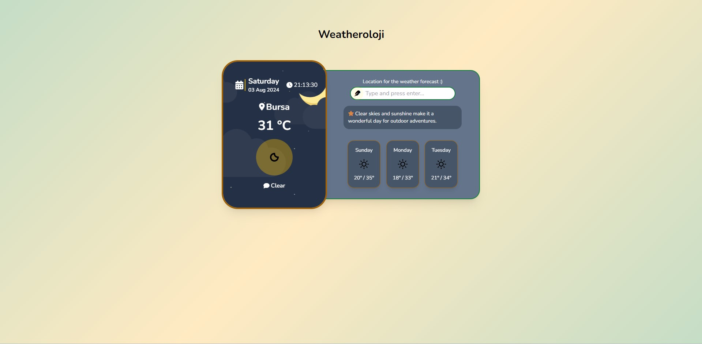
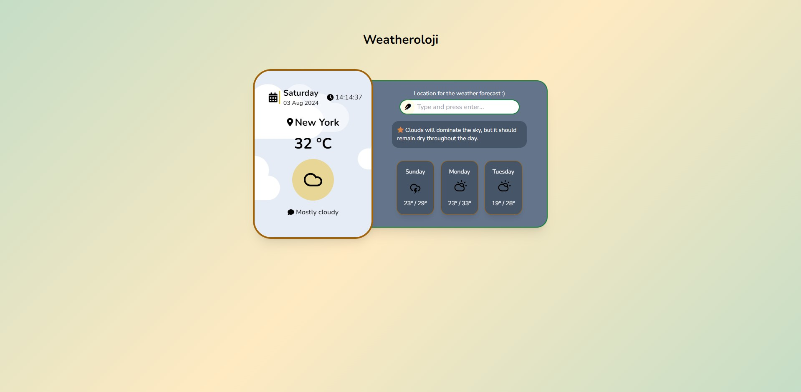

# Weatheroloji

Weatheroloji is a weather application that provides current weather conditions and a 3-day forecast for any city. It uses the AccuWeather API to fetch weather data and displays it in a user-friendly interface.


## Features

- **Current Weather Conditions**: Displays the current temperature, weather icon, and description.
- **3-Day Forecast**: Shows the weather forecast for the next three days.
- **Location-Based Advice**: Provides weather-related advice based on current conditions.

## Getting Started

To get a local copy up and running follow these simple steps:

### Prerequisites

- A web browser (e.g., Chrome, Firefox)
- An internet connection to fetch data from the API

### Installation

1. **Clone the repository:**

   ```bash
   git clone https://github.com/furrkanntas/03_WeatherApp-Weatheroloji.git

2. **Navigate to the project directory:**

   ```bash
   cd weatheroloji

2. **Open index.html in your browser:**

   - Simply double-click the index.html file or open it with your preferred web browser.

## Usage

1) Enter a city name in the input field and press Enter. The application will fetch and display the current weather and the 3-day forecast for the entered city.
2) View the current weather and 3-day forecast displayed on the screen.
3) Advice Section: Check the advice section for tips related to the current weather.

## Local Storage

- **City Storage:** The application stores the last searched city in the browser's local storage. This allows the app to remember the city even after the page is refreshed or reopened.
- If a city is found in local storage, it will be automatically used to fetch and display weather information when the page loads.

## Files

- **`index.html`:** The main HTML file that structures the webpage.
- **`styles.css`:** Contains styles for the application.
app.js: JavaScript file that handles data fetching, UI updates, and event handling.
- **`forecast.js`:** JavaScript file containing the Forecast class to interact with the AccuWeather API.
- **`advise.json`:** JSON file with weather-related advice based on conditions.

## Screenshots

- **Night Interface:**

- **Day Interface:**


## API Key

The application uses the AccuWeather API. To use it, replace the key in forecast.js with your own API key if needed.

## Contributing

Feel free to submit issues or pull requests to improve the application. Make sure to follow the project's coding standards and guidelines.

## License

This project is licensed under the MIT License - see the [LICENSE](LICENSE) file for details.

## Conclusion

Thank you for exploring Weatheroloji! We hope this application helps you stay informed about the weather and makes planning your day easier. If you have any questions, feedback, or suggestions, please feel free to open an issue or contribute to the project. Your input is highly valued!

Stay weather-aware!

Best regards,  
Furkan Taş